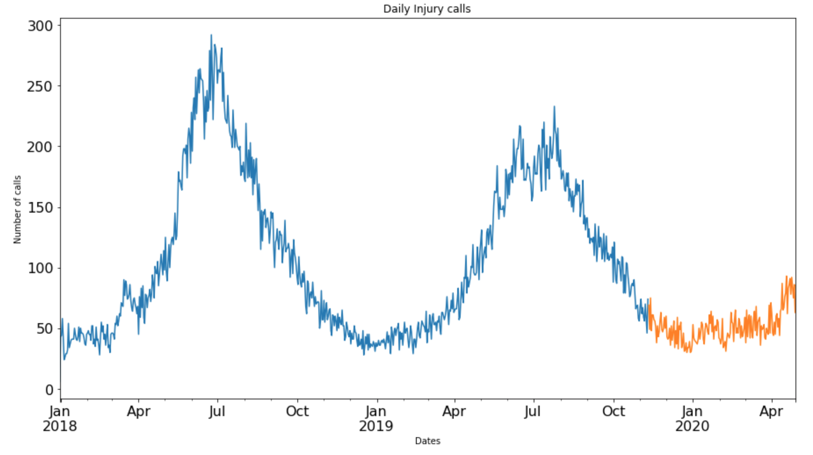

# Final project 
## Overview of the project
As part of Data Analysis course at Code Clan, I had to answer the client's questions through analysing the provided data. I chose Python to do the analysis. The client was the UK organisation which aims to protect animals. 

The organisation was primarily interested in wildlife injuries' trends by region, times of year, types of animals and in all combinations with each other. Also, they were interested in total call volume for advice calls and what was the trend in the provided data. Finally, they have asked to predict how this might look for 2021 including call volumes.

## Raw data and Challenges
Raw data contained free text data and there were no numbers at all. It covered the last three years: 2018, 2019 and 2020 (up to May). There were 4 main columns: description of call, region, time of when a call was reported and animal type. 

**Description column contained a sensitive data** and so it was removed after the cleaning step. Also for demo purposes a fake data was mocked up to mimic data that the organisation may collect. It also contained 2-5 extra unnamed columns and after the first data exploration, it was discovered to contain a shifted data because of the excess text in call description column. 
#### How I tackled the cleaning problems can be seen in [data cleaning scripts.](data_cleaning_scripts)

#### **Briefly** and some steps that I did were: 
* Combined 3 datasets into one & filtered shifted data and assigned it manually.
* **Missing data**: 
* Canged to ‘Unknown’ and removed in description as it was a key column for analysis.
* **Call Description**:
* Created dictionary of keywords such as ‘inj or injuries’.
* Extracted keywords from description column and based on them created a new column of reasons for call -> injuries, rescue, advice, etc.
* New column ‘type of calls’ -> advice and report.
* Final check of all columns and assert that there is no missing data in columns left, except time one.

## Some plots demonstrating the insights
#### More plots and analysis can be seen in [analysis and documentation folder.](analysis_and_documentation/wildlife_synthetic_analysis.ipynb)

## Forecasting
#### More models and work can be seen in [analysis and documentation folder.](analysis_and_documentation/wildlife_synthetic_predictive.ipynb)
### Simple models

### Complex model - Prophet

## Summary of Insights
* Manchester has the most injuries reported. 
* All regions have seasonality in injuries reported - summer time. And summer’s 2019 peak is lower than in summer 2018.
* Deer accounts for 45% of injuries. Then goose and wild bird.
* By around two times more injuries of gull reported in Manchester than in any other region. 
* Most animals don't have seasonal pattern in injuries but animals with highest injuries do have.
* Advice calls have peaks at summer and lower volume of calls in summer 2019.
* Seasonal Naive is good for short period prediction. Prophet is good for long term period prediction. It picked up the general trend which is a decreasing one. However, only 2 seasons of data provided.
* Rescue is the second reason for calls after injuries.

## Future Proposal
* With text data there are more uncertainty. Even though, it extracts a word but it can have different meaning in different text. 
* Dictionary of ‘keywords’ can be completely different for the next dataset.
* Create a function for shifting data based on region column. As it was only 40-50 rows affected by shifting out of 150,000, it was acceptable to do it manually. 
* Filter the injuries and analyse type of injuries. It would answer why Manchester has the most injuries - whether it due to road traffic accidents or anything else? 
* Additional piece of investigation required for the increase of injuries at summer times - whether it happens due to more actuve animals (after hibernation, for example) or people get out more often and tend to find an injured animal more often and so report it?

 

